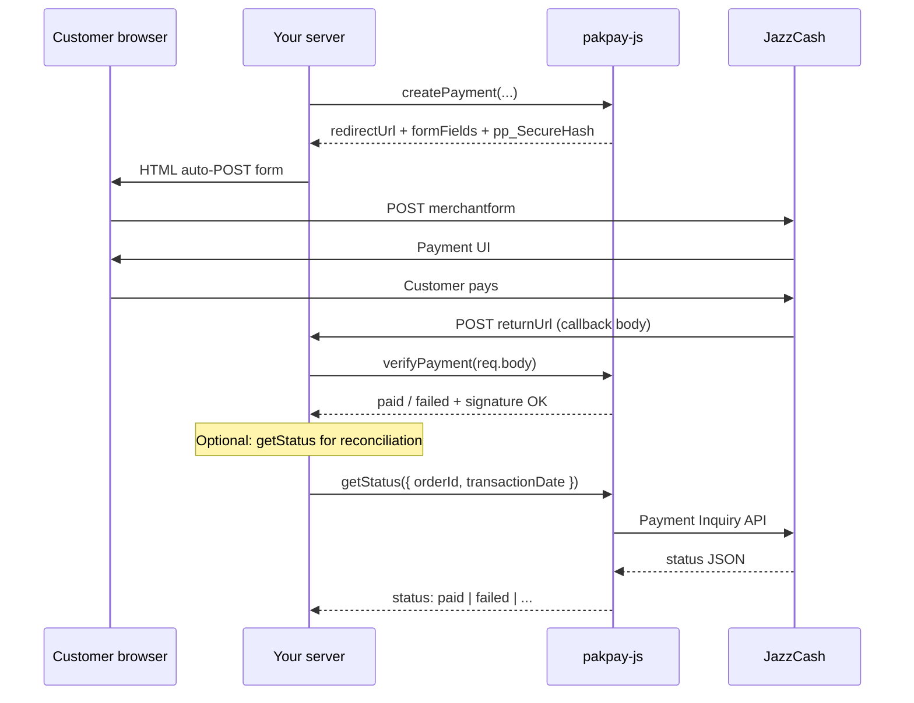

# pakpay-js — Behaviour & flows

This document describes **what the SDK actually does** in code (v1.0, JazzCash only). Use it when integrating or debugging.

---

## Overview

| Concern | Behaviour |
|---------|-----------|
| Runtime | **Server-side only** (Node.js 18+) |
| Provider (v1) | `jazzcash` only |
| Integration type | **Hosted checkout** (browser POST to JazzCash portal) |
| State | **Stateless** — no database inside the SDK |
| Async | `createPayment` and `verifyPayment` are **synchronous**; `getStatus` is **async** |

---

## End-to-end payment flow



### Your responsibilities (not handled by SDK)

1. Store `orderId`, `transactionRef`, and **`pp_TxnDateTime`** when creating a payment (needed for accurate `getStatus`).
2. Mark orders paid only after `verifyPayment` succeeds **and** `data.paid === true`.
3. Use a **cron job** with `getStatus` for orders stuck in `pending` if the callback never arrives.
4. Register `returnUrl` (or its prefix) with JazzCash before going live.

---

## Constructor: `new PakPay(config)`

### Config

| Field | Required | Default | Behaviour |
|-------|----------|---------|-----------|
| `provider` | Yes | — | Must be `"jazzcash"` |
| `merchantId` | Yes | — | Maps to `pp_MerchantID` |
| `password` | Yes | — | Maps to `pp_Password` |
| `integritySalt` | Yes | — | HMAC secret (Integrity Salt from JazzCash portal) |
| `sandbox` | No | `false` | `true` → `https://sandbox.jazzcash.com.pk` |
| `timeout` | No | `30000` | HTTP timeout (ms) for `getStatus` only |

### Errors (throws immediately)

Missing `merchantId`, `password`, or `integritySalt` → `PakPayConfigError` (`INVALID_CONFIG`).

Wrong `provider` → `PakPayConfigError`.

---

## `createPayment(input)`

**Type:** synchronous → `PakPayResult<CreatePaymentData>`

Does **not** call JazzCash over the network. It builds a signed field set for your app to POST from the browser.

### Input

| Field | Required | Behaviour |
|-------|----------|-----------|
| `amount` | Yes | **PKR** (e.g. `1000` = Rs 1,000). Converted to paisa: `Math.round(amount * 100)` → `pp_Amount` |
| `orderId` | Yes | Max 20 chars after sanitization; invalid chars stripped (`[^a-zA-Z0-9._/-]`) |
| `returnUrl` | Yes | Must start with `http://` or `https://` → `pp_ReturnURL` |
| `customerName` | No | → `ppmpf_1` |
| `customerEmail` | No | → `ppmpf_2` |
| `customerPhone` | No | → `ppmpf_3` |
| `description` | No | Default: `"Payment for {orderId}"`, max 200 chars → `pp_Description` |
| `expiryMinutes` | No | Default: **1440** (24 hours) → `pp_TxnExpiryDateTime` |

### Fixed JazzCash fields (set by SDK)

| Field | Value |
|-------|--------|
| `pp_Version` | `1.1` |
| `pp_TxnType` | `MWALLET` |
| `pp_Language` | `EN` |
| `pp_TxnCurrency` | `PKR` |
| `pp_TxnRefNo` | Same as sanitized `orderId` |
| `pp_BillReference` | Same as sanitized `orderId` |
| `pp_TxnDateTime` | Current time `yyyyMMddHHmmss` |
| `pp_SubMerchantID`, `pp_BankID`, `pp_ProductID` | Empty string |
| `ppmpf_4`, `ppmpf_5` | Empty string |

### Hash (`pp_SecureHash`)

Uses **hosted checkout field order** (same as common JazzCash Node integrations):

`salt & pp_Amount & pp_BankID & … & ppmpf_5` (only non-empty values), then **HMAC-SHA256** with salt as key, **hex uppercase**.

### Success `data`

| Field | Meaning |
|-------|---------|
| `orderId` | Sanitized merchant reference |
| `transactionRef` | Same as `orderId` (`pp_TxnRefNo`) |
| `redirectUrl` | Sandbox or production + `/CustomerPortal/transactionmanagement/merchantform/` |
| `method` | Always `"POST"` |
| `formFields` | Full POST body including `pp_SecureHash` |

### Failure

Returns `{ success: false, error, code }` — e.g. invalid amount, bad `returnUrl`, empty `orderId`. Does **not** throw (except constructor issues).

### Redirecting the customer

Your server must return HTML (or frontend) that **POSTs** `formFields` to `redirectUrl`. See `examples/express-callback/server.mjs`.

---

## `verifyPayment(payload)`

**Type:** synchronous → `PakPayResult<VerifyPaymentData>`

Call this on your **return URL** handler with the body JazzCash POSTs back (`application/x-www-form-urlencoded`).

### Steps inside SDK

1. Normalize all values to strings.
2. Recompute hash from all `pp_*` fields (except `pp_SecureHash`) using:
   - hosted checkout order, **or**
   - alphabetical `pp_*` order (official guide §14.2)  
   Match either → signature OK (timing-safe compare).
3. If hash invalid → `{ success: false, code: "INVALID_SIGNATURE" }`.
4. Read `pp_ResponseCode` or `pp_PaymentResponseCode`.
5. Set `paid: true` only for codes mapped as paid (see below).

### Success `data`

| Field | Behaviour |
|-------|-----------|
| `verified` | Always `true` when `success` |
| `paid` | `true` if response code ∈ `000`, `121`, `200`, `T00` |
| `orderId` | `pp_BillReference` ?? `pp_TxnRefNo` |
| `transactionRef` | `pp_TxnRefNo` ?? `orderId` |
| `amount` | `pp_Amount` converted from paisa → PKR |
| `gatewayCode` / `gatewayMessage` | Raw JazzCash codes |
| `provider` | `"jazzcash"` |
| `raw` | Full callback payload |

### Important

- **`verified` ≠ paid.** Signature can be valid while payment failed (`paid: false`).
- Always check **`data.paid`** before fulfilling the order.
- Do not trust callback without verification, even if `pp_ResponseCode` looks like success.

---

## `getStatus(input)`

**Type:** async → `Promise<PakPayResult<PaymentStatusData>>`

Calls JazzCash **Payment Inquiry** API over HTTP POST JSON.

### Input

| Field | Required | Behaviour |
|-------|----------|-----------|
| `orderId` | Yes | Returned in `data.orderId` (your reference) |
| `transactionRef` | No | Defaults to `orderId` → `pp_TxnRefNo` |
| `transactionDate` | No | Defaults to **now** `yyyyMMddHHmmss` → `pp_TxnDateTime` |

**Critical:** JazzCash expects `pp_TxnDateTime` to match the **original** transaction time. If you omit it, inquiry may fail or return wrong results. **Store `formFields.pp_TxnDateTime` from `createPayment` in your database** and pass it here.

### Request

- URL: `{sandbox|production}/ApplicationAPI/API/PaymentInquiry/Inquire`
- Hash: `salt & pp_MerchantID & pp_Password & pp_TxnRefNo` (fixed order), HMAC-SHA256, uppercase hex
- Also sends: `pp_Version: 1.1`, `pp_TxnType: MWALLET`

### Success `data.status`

| `status` | Typical JazzCash codes |
|----------|-------------------------|
| `paid` | `000`, `121`, `200`, `T00` |
| `failed` | `001`–`004`, `095`, `101`, `109`, `112`, `115`, `122`, … |
| `expired` | `116`, `117` |
| `pending` | `124` (OTC voucher issued, not yet paid) |
| `unknown` | Anything else |

### Failure

Network/parse/HTTP errors → `{ success: false, code: "GATEWAY_ERROR" }`.

---

## Response envelope (all methods)

```ts
// Success
{ success: true, data: T }

// Failure
{ success: false, error: string, code?: string }
```

| `code` | When |
|--------|------|
| `VALIDATION_ERROR` | Bad input to `createPayment` |
| `INVALID_SIGNATURE` | `verifyPayment` hash mismatch |
| `GATEWAY_ERROR` | `getStatus` HTTP/API failure |
| `INVALID_CONFIG` | Constructor only (thrown as `PakPayConfigError`) |

---

## Sandbox vs production

| `sandbox` | Base URL |
|-----------|----------|
| `true` | `https://sandbox.jazzcash.com.pk` |
| `false` | `https://payments.jazzcash.com.pk` |

JazzCash may require a **`Test`** prefix on merchant ID in sandbox (see their merchant PDF). The SDK does not add this automatically.

---

## Security

- Credentials exist only in memory on your server.
- `verifyPayment` uses **timing-safe** hash comparison.
- Never expose `merchantId` / `password` / `integritySalt` to the browser or mobile app.
- `formFields` includes `pp_Password` — only embed in server-rendered auto-submit form, not in public APIs.

---

## Known limitations (v1.0)

| Limitation | Workaround |
|------------|------------|
| Easypaisa not implemented | Coming v1.1 |
| Hosted checkout only (no direct MWALLET API) | Use raw JazzCash API separately if needed |
| `getStatus` default `transactionDate` may be wrong | Pass stored `pp_TxnDateTime` |
| `orderId` / `transactionRef` are the same in `createPayment` | Use one consistent ID in your DB |
| Unofficial SDK | Test thoroughly in sandbox before live |

---

## Related docs

- [API Reference](./API-REFERENCE.md) — types and examples
- [JazzCash setup](./jazzcash-setup.md) — credentials & sandbox
- [Publish to npm](./PUBLISH-NPM.md)
